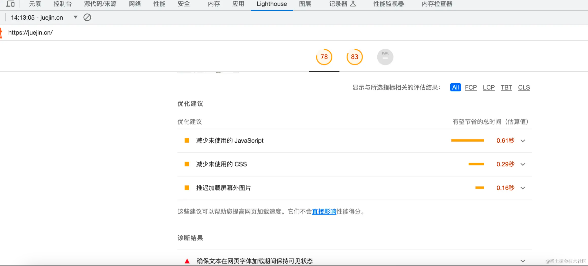

### Network 分析

通过对接口的请求时间及调用次数进行优化


### Lighthouse 分析

优化点逐一进行优化



### Performance 分析

性能分析工具就比较复杂了，需要具体通过某一段时间内页面交互的运行情况，有明显卡顿现象，对右上角红色三角的长任务代码进行优化


### chunk 分析

通过分析打包体积来尽可能减少打包后体积


### 具体怎么优化呢？

#### 路由懒加载

SPA 项目，一个路由对应一个页面，如果不做处理，项目打包后，会把所有页面打包成一个文件，当用户打开首页时，会一次性加载所有的资源，造成首页加载很慢，降低用户体验

#### 组件懒加载

除了路由的懒加载外，组件的懒加载在很多场景下也有重要的作用

举个 🌰：比如弹窗组件 A 页面和 b 页面都引用了弹窗组件 此时项目打包后发现会重复引用弹窗组件

当用户打开 home 页时，会一次性加载该页面所有的资源，我们期望的是用户触发按钮后，再加载该弹框组件的资源

这种场景下，就很适合用懒加载的方式引入

弹框组件懒加载：

```js
<script>
  const dialogInfo = () => import(/* webpackChunkName: "dialogInfo" */
  'src/components/dialogInfo');
</script>
```

重新打包后，当用户点击按钮时，才会去加载 dialogInfo.js 和 dialogInfo.css

#### 组件懒加载的使用场景

有时资源拆分的过细也不好，可能会造成浏览器 http 请求的增多
总结出三种适合组件懒加载的场景：
1）该页面的 JS 文件体积大，导致页面打开慢，可以通过组件懒加载进行资源拆分，利用浏览器并行下载资源，提升下载速度（比如首页）
2）该组件不是一进入页面就展示，需要一定条件下才触发（比如弹框组件）
3）该组件复用性高，很多页面都有引入，利用组件懒加载抽离出该组件，一方面可以很好利用缓存，同时也可以减少页面的 JS 文件大小（比如表格组件、图形组件等）

#### 对于图片资源

图片压缩、每次使用在线服务手动压缩较为麻烦，可以直接在构建流程中加入压缩图片

```
// install
npm i image-webpack-loader -D
rules: [
    {
    test: /.(jpe?g|png|gif|svg)$/i,
    type: 'asset/resource',
    generator: {
        filename: 'images/[name].[contenthash:8].[ext]',
    },
    use: [
        {
        loader: 'image-webpack-loader',
        },
    ],
```

#### JS 的 6 种加载方式

1. 正常模式
   这种情况下 JS 会阻塞 DOM 渲染，浏览器必须等待 index.js 加载和执行完成后才能去做其它事情

2. async 模式

async 模式下，它的加载是异步的，JS 不会阻塞 DOM 的渲染， 加载是无顺序的，当它加载结束，JS 会立即执行

使用场景：若该 JS 资源与 DOM 元素没有依赖关系，也不会产生其他资源所需要的数据时，可以使用 async 模式，比如埋点统计、广告等

3. defer 模式

defer 模式下，JS 的加载也是异步的也不会阻塞 DOM 的渲染，defer 资源会在 DOMContentLoaded 执行之前，并且 defer 是有顺序的加载

如果有多个设置了 defer 的 script 标签存在，则会按照引入的前后顺序执行，即便是后面的 script 资源先返回

所以 defer 可以用来控制 JS 文件的执行顺序，比如 antd.js 和 react.js，因为 antd.js 依赖于 react.js，所以必须先引入 react.js，再引入 antd.js

```html
<script defer src="react.js"></script>
<script defer src="antd.js"></script>
```

4. module 模式

在主流的现代浏览器中，script 标签的属性可以加上 type="module"，浏览器会对其内部的 import 引用发起 HTTP 请求，获取模块内容。这时 script 的行为会像是 defer 一样，在后台下载，并且等待 DOM 解析

5. preload 预加载

```html
<link rel="preload" as="script" href="index.js" />
```

表示用户十分有可能需要在当前浏览中加载目标资源，所以浏览器必须预先获取和缓存对应资源。

preload 加载的资源是在浏览器渲染机制之前进行处理的，并且不会阻塞 onload 事件；
  
preload 加载的 JS 脚本其加载和执行的过程是分离的，即 preload 会预加载相应的脚本代码，待到需要时自行调用

6. Prefetch预请求

```html
<link rel="prefetch" as="script" href="index.js">
```
prefetch 是利用浏览器的空闲时间，加载页面将来可能用到的资源的一种机制；通常可以用于加载其他页面（非首页）所需要的资源，以便加快后续页面的打开速度


#### Web Worker 优化长任务

在HTML5的新规范中，实现了 Web Worker 来引入 js 的 “多线程” 技术, 可以让我们在页面主运行的 js 线程中，加载运行另外单独的一个或者多个 js 线程

由于浏览器 GUI 渲染线程与 JS 引擎线程是互斥的关系，当页面中有很多长任务时，会造成页面 UI 阻塞，出现界面卡顿、掉帧等情况

- 计算时长 超过多长时间 适合用Web Worker

原则上，运算时间超过50ms会造成页面卡顿，属于Long task，这种情况就可以考虑使用Web Worker

但还要先考虑通信时长的问题

假如一个运算执行时长为100ms, 但是通信时长为300ms, 用了Web Worker可能会更慢

一句话： Web Worker专门处理复杂计算的，从此让前端拥有后端的计算能力

#### 虚拟滚动
虚拟滚动基本原理：

计算出 totalHeight 列表总高度，并在触发时滚动事件时根据 scrollTop 值不断更新 startIndex 以及 endIndex ，以此从列表数据 listData 中截取对应元素
