# JavaScript console 方法

### 1. table()

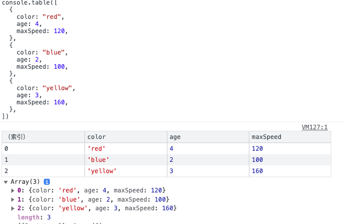

### 2. assert()

console.assert() 非常适合调试目的，它接收断言，并在断言为 false 时向控制台写入错误信息。但如果是 true ，则不会发生任何事情:

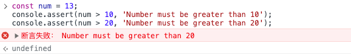

### 3. trace()

console.trace() 可以帮助您在调用它的位置输出当前堆栈跟踪。例如

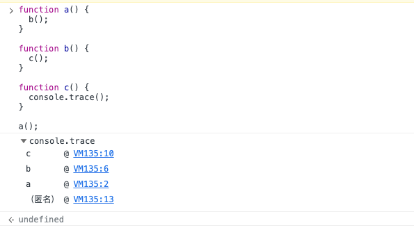

### 4. error()

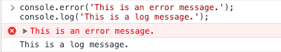

### 5. warn()

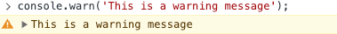

### 6. count() 和 countReset()

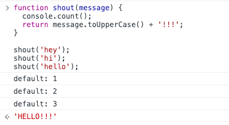

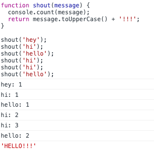

> countReset() 方法将标签的计数设回零。

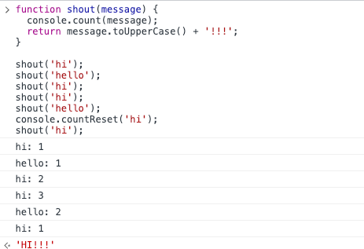

### 7. time(), timeEnd(), and timeLog()

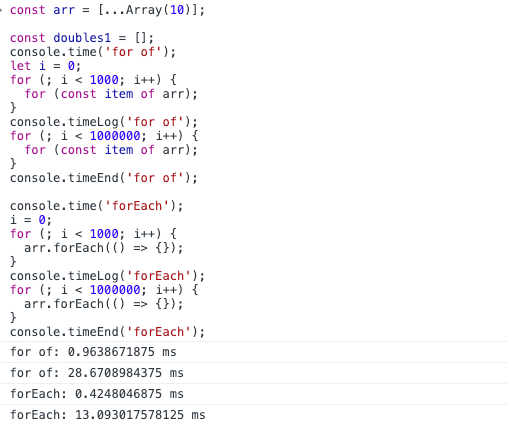

### 8. clear()

console.clear() 通过清除日志来清除控制台中的杂乱信息。

### 9. group(), groupCollapsed(), and groupEnd()

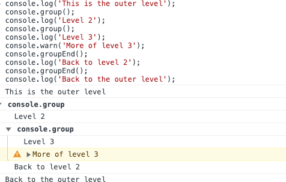

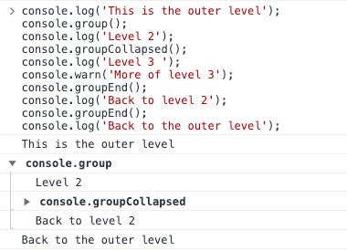

### 10. dir()

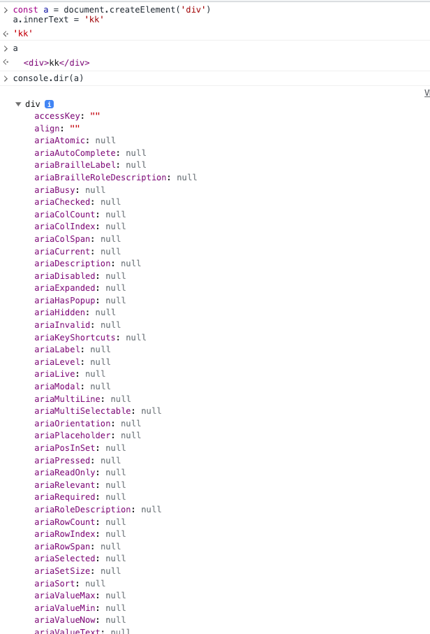
